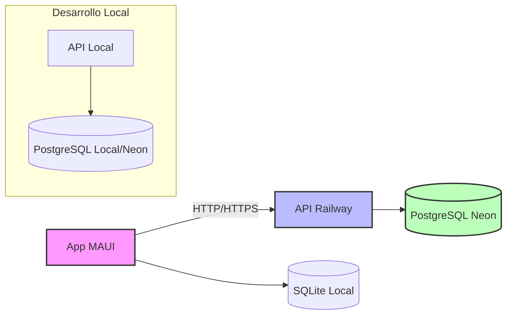

<h1 align="center">👋 ¡Hola! Soy Lisandro Semperez</h1> 
<h3 align="center">🚀 Desarrollador .NET MAUI & Backend | C# | Arquitecturas Limpias | Full-Stack</h3>
 
  <a href="https://www.linkedin.com/in/lisandro-semperez-24b1782b8/">LinkedIn</a> • <a href="mailto:lisandrosemperez@gmail.com">Email</a> • <a href="https://github.com/lisandrosemperez-collab/AnotadorGymApp">App Móvil</a> • <a href="https://github.com/lisandrosemperez-collab/AnotadorGymAppApi">API Backend</a> • <a href="https://anotadorgymappapi-production.up.railway.app/index.html">API en Vivo</a> 

---

## 🧑‍💻 Sobre Mí

Desarrollador especializado en el ecosistema .NET, con un fuerte enfoque en crear **aplicaciones móviles multiplataforma nativas** usando .NET MAUI. Me apasiona implementar **arquitecturas limpias, código mantenible y experiencias de usuario fluidas**. 

Mi enfoque se basa en construir soluciones integrales: diseño la API, la despliego en la nube, y desarrollo la app que la consume, garantizando coherencia y calidad en todas las capas.

---

## 🏆 Proyecto Destacado: Ecosistema Completo .NET

### [🏋️ AnotadorGymApp - Aplicación MAUI Completa](https://github.com/lisandrosemperez-collab/AnotadorGymApp) + [🌐 API Backend](https://github.com/lisandrosemperez-collab/AnotadorGymAppApi)
**Sistema profesional de tracking de entrenamientos que desarrollé desde cero, compuesto por una app móvil multiplataforma y una API RESTful desplegada en la nube.**

Este ecosistema demuestra mis **habilidades** en:
### 📱 Desarrollo Móvil (.NET MAUI)
- **Arquitectura Clean / MVVM** con separación en capas.
- **Persistencia local con SQLite y Entity Framework Core** (incluyendo migraciones).
- **Sincronización con API REST** para mantener datos actualizados.
- **UI/UX profesional:** temas claro/oscuro dinámicos, splash screen con progreso, gráficos interactivos (Microcharts).
- **Gestión de imágenes** optimizada y offline-first.
- 
### 🌐 Backend API (.NET 9)

- **API RESTful** con controladores, autenticación JWT y documentación Swagger.
- **Base de datos PostgreSQL** en Neon con más de 900 ejercicios precargados.
- **Importación masiva** de ejercicios desde archivos JSON (validación, límites de tamaño).
- **Contenedorización** con Docker y despliegue automatizado en Railway.
- **Variables de entorno** para seguridad (JWT, cadenas de conexión).

### 🔗 Integración Total
- La app móvil consume la API para sincronizar ejercicios y rutinas.
- La base de datos en la nube (Neon) alimenta la app local (SQLite) para uso offline.
- Flujo completo: backend → nube → frontend móvil.
  
---

## 🛠️ **Stack Tecnológico Principal**

### 💻 Backend & API

### 📱 Frontend Móvil

### **🗄️ Bases de Datos & Persistencia**

### **☁️ DevOps & Cloud**

---

## ⚙️ **Características Técnicas Avanzadas Implementadas**

### **🏗️ Arquitectura & Patrones (Backend)**
- **API RESTful** con separación de responsabilidades (controladores/servicios).
- **Autenticación JWT** con políticas de autorización.
- **Inyección de dependencias nativa de .NET** 
- **Documentación automática con Swagger/OpenAPI.**

### **🏗️ Arquitectura & Patrones (Móvil)**
- **Splash Screen Inteligente** con ProgressBar que muestra:
  - Inicialización de base de datos
  - Carga de datos desde JSON
  - Verificación de integridad de datos
  - Servicios de Imágenes para Rutinas
- **Tema Claro/Oscuro** implementado globalmente
  - Cambio en tiempo real sin reiniciar la app
  - Persistencia de preferencias del usuario
- **UI/UX optimizada** para diferentes tamaños de pantalla

### **🗄️ Gestión de Datos Profesional**
- **Backend:** PostgreSQL con Entity Framework Core, migraciones automáticas y seeding de 900+ ejercicios.
- **Móvil:** SQLite local con EF Core, sincronización bidireccional con la API.
- **Sistema de seeding desde JSON** - Poblado automático inicial usando migraciones EF Core.
- **Relaciones complejas mapeadas por EF Core:**
  - Ejercicios ↔ Rutinas
  - Historial de entrenamientos
  - Progreso del usuario
- **Optimización de consultas** con LINQ y configuraciones específicas de EF Core.

### **📊 Métricas & Analytics**
- **Gráficos interactivos** con Microcharts
- **Estadísticas en tiempo real**
- **Seguimiento de progreso** histórico
- **Exportación de datos**

### **🔐 Seguridad**
- **JWT** para endpoints protegidos (importación/validación).
- **Variables de entorno** para secretos (cadena de conexión, claves JWT).
- **Validación de archivos** (tamaño, extensión, estructura) en la API.

### **🚀 DevOps & Cloud**
- **Docker** multi-stage para imágenes optimizadas.
- **Despliegue continuo desde GitHub a Railway.**
- **Base de datos PostgreSQL en Neon** (totalmente gestionada, gratis y rápida).
- **Configuración de entorno diferenciada** (desarrollo/producción).

---

## 🏗️ **Arquitectura del Proyecto**

### 📱 App MAUI (Cliente)
- Consume la API para poblar base de datos local SQLite con ejercicios (próximamente también rutinas).
- Almacena datos localmente (modo offline).
- Interfaz adaptable con temas claro/oscuro.

### 🌐 API Backend (Servidor)
- Endpoints RESTful documentados con Swagger.
- Autenticación JWT para operaciones sensibles.
- Lógica de negocio y acceso a datos con EF Core.
- Desplegada en Railway con Docker.

### 🗄️ Base de Datos (Neon)
- PostgreSQL en la nube, con 900+ ejercicios precargados.
- Escalable y con backups automáticos.

## **🔮 Roadmap & Mejoras Futuras**

### **✅ COMPLETADO**
- ✅ API RESTful con autenticación JWT y documentación Swagger.
- ✅ Despliegue en Railway con Docker.
- ✅ Base de datos PostgreSQL en Neon con seeding masivo.
- ✅ App MAUI con SQLite, temas claro/oscuro, gráficos y splash screen.
- ✅ Sincronización básica entre app y API.

### **🚧 EN PROGRESO**
- 🔄 Sincronización bidireccional completa (offline-first robusto).
- 🔄 Sistema de caché avanzado en la app.
- 🔄 Tests unitarios en API y app.

## **📫 Conectemos**

     

 <i>"Convierto café en código, y problemas en soluciones elegantes."</i>  Buscando oportunidades para crear aplicaciones completas que impacten positivamente. 

